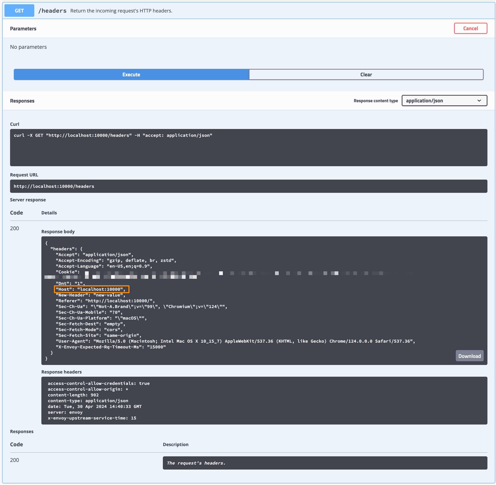

# dispatch calls

Run `make simulate` and then curl localhost:10000 or visit this url in your browser

In httpbin you will see the header [here](http://localhost:10000/#/Request_inspection/get_headers)

